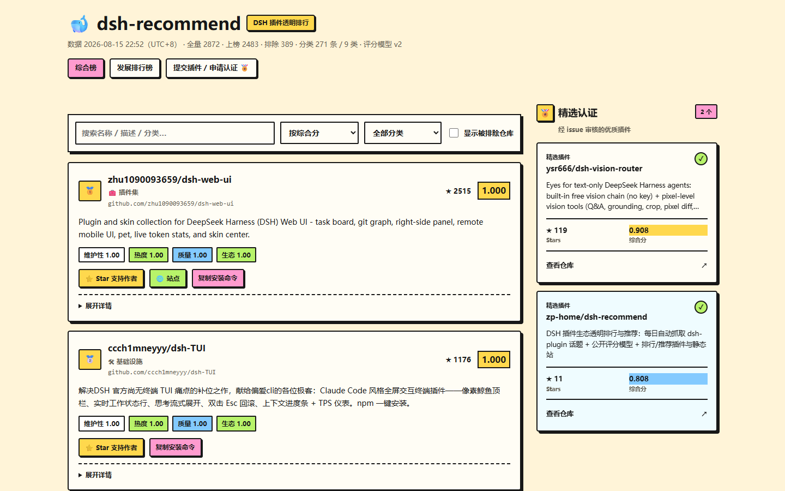
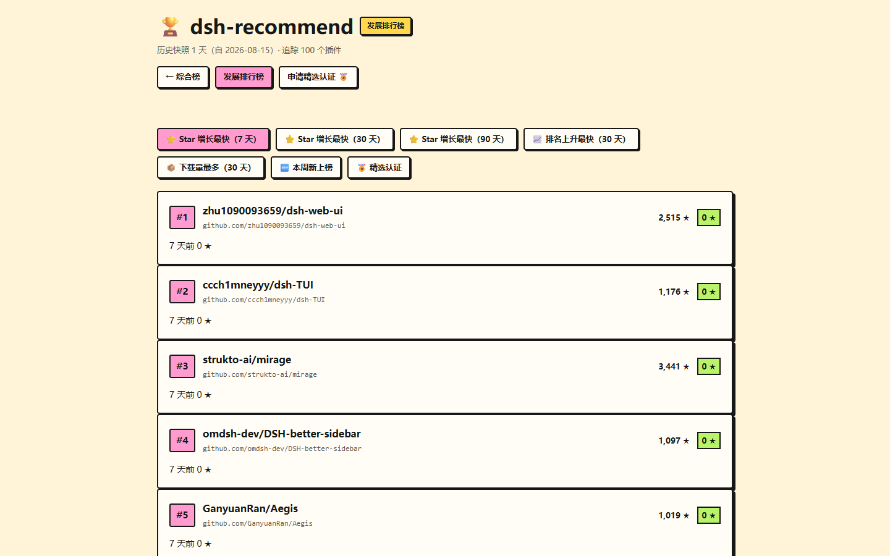

# 🐋 dsh-recommend

> DSH 插件生态的**透明排行与推荐**：每 5 小时自动抓取全 GitHub 的 `dsh-plugin` 话题仓库，按公开的评分模型打分排序；DSH 插件与静态站消费同一份数据。

<p>
  <a href="https://github.com/zp-home/dsh-recommend"></a>
  <a href="LICENSE"></a>
  <a href="https://github.com/zp-home/dsh-recommend/actions/workflows/sync.yml"></a>
  <a href="https://github.com/zp-home/dsh-recommend/actions/workflows/validate.yml"></a>
  <a href="https://zp-home.github.io/dsh-recommend/site/"></a>
  <a href="https://zp-home.github.io/dsh-recommend/site/rankings.html"></a>
  <a href="https://github.com/topics/dsh-plugin"></a>
  <a href="https://github.com/zp-home/dsh-recommend/blob/main/docs/trends.md"></a>
  <a href="https://awesome-dsh-plugin.com"></a>
  
</p>

[设计文档](docs/DESIGN.md) · [评分模型](docs/scoring.md) · [路线图](docs/roadmap.md) · [数据](data/rankings.json) · [English](README.md)

## ✨ 特性

- **透明**：评分公式、权重、全部原始数据都公开在这个仓库里，任何人 `clone` 后跑一遍 `node scripts/sync.mjs` 即可复算——这是排行类项目信任的基石
- **可信**：官方本体/非插件 denylist（`scripts/exclude-list.json`）+ 榜单前 200 名**深扫插件性验证**（`scripts/scan.mjs` 检测 `dsh` 声明 / `@deepseek-ai/*` 依赖 / cordis 配置 / skills 特征），未检出特征的仓库排除出榜并透明标注；hub 目录抓取失败会让 CI 红，信号源健康度随时可见
- **可审计全量**：GitHub Search 单查询超过 1000 条时，采集器按创建日期、仓库大小与 Star 的无重叠闭区间递归分片；`topic-coverage.json` 记录每个叶子查询的 `total_count`、去重数、重试与溢出。任一叶子不完整即终止全量发布，不以部分数据更新榜单
- **自动化**：GitHub Actions 每 5 小时全量重算并提交 `data/`（含深扫、历史快照、徽章、月度报告），数据永不人工维护
- **一份数据，多个消费端**：`data/registry.json` 是唯一事实源，静态排行站、DSH 插件（模型工具 + 设置页标签）、外部工具共用；`data/history.json` 提供每日趋势

## 🚀 快速开始

### 1️⃣ 网页版排行（不用安装）

👉 打开 **https://zp-home.github.io/dsh-recommend/site/** —— Neo-Brutalism 高对比排行榜：醒目的前三名奖牌、四维信号分数与 🏅 精选认证，支持搜索 / 分类筛选 / 四种排序（综合分 / 热度 / 最近更新 / 最新发布）、分页浏览、详情展开（主题标签 / 许可证 / 发布时间 / 深扫状态）、近 N 天**综合分走势图**，以及一键复制**安装命令**。

🏆 **发展排行榜**（独立页面）：**https://zp-home.github.io/dsh-recommend/site/rankings.html** —— star 增长最快（7/30/90 天）、排名上升最快、npm 下载量最多、本周新上榜、精选认证，每条带增长曲线 sparkline。

**📸 效果预览：**





也可以直接看原始数据：[`data/rankings.json`](data/rankings.json)（每 5 小时自动更新）、[`data/history.json`](data/history.json)（每日趋势快照）、[`data/trends.json`](data/trends.json)（派生发展榜）。

### 2️⃣ 在 DSH 里安装插件（✅ 已真机验证）

**方式 A：npm 安装（国内用户推荐，走 npmmirror 镜像）**

```sh
dsh plugin --profile web add dsh-recommend
# 重启 dsh web 后生效
```

**方式 B：GitHub 直装**

```sh
dsh plugin --profile web add github:zp-home/dsh-recommend
dsh --profile web --dump-config   # 应出现 "# == dsh-recommend" 层
# 重启 dsh web 后生效
```

**方式 C：本地目录安装（完全离线，拷文件夹即可）**

```sh
dsh plugin --profile web add D:\路径\dsh-recommend
```

> 💡 **国内网络提示**：插件榜单数据默认从 `raw.githubusercontent.com` 拉取（`sync_registry` 工具）。无法访问该域名时，可编辑已安装插件包中的 `cordis.patch.yml`（`node_modules/dsh-recommend/cordis.patch.yml`），把 `dsh-recommend` 的 `dataUrl` 改为 `https://cdn.jsdelivr.net/gh/zp-home/dsh-recommend@main/data/registry.json`（jsDelivr CDN，国内一般可达，数据可能有数小时缓存延迟），改后重启 DSH。

安装后获得：

| 面 | 内容 |
|---|---|
| 模型工具 ×5 | `rank_plugins` 榜单查询（可过滤分类/维度）· `search_plugins` 检索 · `recommend_plugins` 按目标推荐（中英同义词扩展，支持 `keywords` 参数）· `trend_plugins` 发展榜（star 增长/排名上升/下载量/新上榜/精选）· `sync_registry` 刷新本地数据（含历史与趋势，报告 hub/深扫健康度） |
| 设置页标签 | 设置 → 插件 → 「**插件排行**」：紧凑排行榜（搜索/分类/排序/分页）+ 一键刷新 + **一键安装**（⬇ 安装 / ✓ 已安装）+ 安装命令复制 + 详情展开 + 🏅 认证徽章 + 趋势走势图，随 DSH 亮/暗主题自动适配，zh/en 双语 |

> 仓库根目录即插件包（`dsh.bundle` + `dsh.client` 双声明，构建产物 `lib/` 随库提交，git 安装无需构建）。

### 3️⃣ 自己重跑数据管道

```sh
# 需要 Node 18+（深扫需 GITHUB_TOKEN，CI 自动注入）
node scripts/sync.mjs            # fetch → score → scan（深扫）→ score → history → badge → validate
node scripts/validate.mjs        # 只校验
node scripts/smoke.mjs           # 管道纯函数冒烟测试
```

未设置 `GITHUB_TOKEN` 时使用未认证限额（够跑一轮，自动跳过深扫）；CI 中自动注入 token。

## 🛡 插件作者：挂一个分数徽章

榜单前 200 名每 5 小时自动生成 shields 徽章（`data/badges/<owner>__<name>.json`）。将下面这行中的 `<owner>__<name>` 替换为你的 GitHub 仓库路径；静态站和设置页也可直接复制链接：

```md
[](https://github.com/zp-home/dsh-recommend)
```

## 🏅 精选认证（给优质插件作者的激励）

想让你的插件获得官方「🏅 精选认证」？两步：

1. 提交 [收录/认证 Issue](https://github.com/zp-home/dsh-recommend/issues/new?template=submit-plugin.yml)，勾选「申请精选认证」，可选填 npm 包名（用于下载量榜）；
2. 审核通过后，你的插件在榜单与设置页显示 🏅，并进入精选认证榜。

认证是**展示层激励，不改变评分**（评分公式始终保持透明可复算）。审核标准：可正常安装（dsh.bundle 或 repository-plugin）、有实际功能、README 完善、维护活跃。

## 📨 针对性邀请开发者（维护者运营工具）

生态里大量优质插件**已被自动收录但从未主动提交认证**。`scripts/invite.mjs` 从 registry 自动筛出高价值未认证插件，分层生成邀请清单与个性化话术：

```sh
node scripts/invite.mjs              # 生成 docs/invites.md（全部目标）
node scripts/invite.mjs --tier 1     # 只生成 Tier 1（头部标杆 ★≥800）
```

分层：**Tier 1** 头部标杆（★≥800）· **Tier 2** 优质活跃（★≥100 且 30 天活跃）· **Tier 3** 潜力新星（★≥30 且 score≥0.6 且活跃）。清单含每个插件的真实数据（星级/分数/分类/活跃度）与**已预填数据的邀请话术**，复制即用——在作者仓库的 issue / discussion 留言，或邮件联系。

## 📊 当前数据

- 全量抓取 **2200+** 个 `dsh-plugin` 话题仓库；排除占位/空仓库/官方本体/非插件后 **1900+** 个上榜（具体见 `data/meta.json`）
- 评分 = **0.35×维护性 + 0.30×热度 + 0.20×质量 + 0.15×生态**（公式与权重全公开，改版走评审，详见 [docs/scoring.md](docs/scoring.md)）
- 排除条目保留在 `data/registry.json` 并附原因（fork / 已归档 / 空仓库 / 无描述 / 占位特征 / 官方本体 / 深扫未检出插件特征）

## 📁 仓库结构

```
data/           每 5 小时生成的 registry.json / rankings.json / meta.json / history.json / trends.json / badges/（Git 即数据库）
scripts/        fetch（采集）→ score（过滤+评分）→ scan（深扫）→ history（快照）→ trends（趋势派生）→ badge（徽章）→ report（月报）→ validate（门禁）→ sync（总入口）
src/            插件源码（host 工具半 + web 数据路由半 + browser 设置页半）
lib/            构建产物（随库提交，git 安装免构建）
cordis.patch.yml 插件配置层（bundle patch）
site/           静态站（综合榜 index + 发展排行榜 rankings，零构建）
docs/           设计 / 评分模型 / 趋势模型 / 路线图 / 决策记录 / 月度报告
scripts/curated.json 精选认证列表（issue 审核自动维护）
.github/        Actions（每 5 小时 cron + PR 校验 + 精选认证 curate）与提交插件表单
```

## 数据源

| 源 | 内容 | 用途 |
|---|---|---|
| GitHub Search API `topic:dsh-plugin` | 全部公开仓库 + stars/更新时间/license/size 等 | 主数据源 |
| [hub 目录公开镜像](https://github.com/0xsline/awesome-deepseek-harness) | 官方精选目录与分类（hub 组织仓库私有，经每日镜像） | 分类映射 + 生态信号 |
| 三个 awesome 列表 | 社区人工精选 | 生态信号 |
| GitHub Contents API（深扫） | 榜单前 200 名的根目录 / package.json | 插件性验证（排除非插件） |
| npm registry | 精选插件周/月下载量 | 「下载量最多」榜数据源 |

## 🧩 插件架构（简要）

- **三行配置**：`dsh-recommend`（工具半，任何 profile 可用）/ `dsh-recommend/web`（同源数据路由，仅 web profile）/ 浏览器排行标签半（由官方 client-modules 扫描 `dsh.client` 自动供给，无需独立配置行）
- **数据安全**：插件只读 `registry.json` 并展示，从不执行任何被收录插件的代码
- 真机验证记录与踩坑（`window is not defined`、`github:` 安装取根 package.json 等）见 [ADR-0003](docs/decisions/0003-single-package-dual-half.md)

## 开发

```sh
npm install        # 开发依赖（react/typescript/tsdown）
npm run typecheck  # tsc --noEmit
npm run bundle     # tsdown 构建 lib/
npm run sync       # 重跑数据管道
```

## 收录与免责

**收录 ≠ 安全背书。** 本仓库只做只读元数据分析，从不 clone、从不执行被收录插件的代码。安装任何第三方插件前请自行审查源码、权限与许可证。详见 [SECURITY.md](SECURITY.md)。

## 路线图

| 阶段 | 状态 |
|---|---|
| M1 数据管道 + 静态排行站 | ✅ |
| M1.5 深扫与信号增强（插件性验证 / denylist / 历史 / 徽章） | ✅ |
| M2 DSH 插件（工具 + 设置页标签） | ✅ 真机验证通过 |
| M3 推荐逻辑升级 + 人工精选层 | 🔨 进行中（同义词推荐已落地） |
| M4 生态运营（徽章 / 月度报告 已落地；安装量遥测 ⏳） | 🔨 |

## 社区与贡献

- 提交插件收录：[Issue 表单](https://github.com/zp-home/dsh-recommend/issues/new?template=submit-plugin.yml)（或直接打 `dsh-plugin` 话题，每日同步自动收录）
- 贡献指南：[CONTRIBUTING.md](CONTRIBUTING.md)
- 上游生态：[DeepSeek Harness](https://github.com/deepseek-ai/deepseek-harness) · [`dsh-plugin` 话题](https://github.com/topics/dsh-plugin) · [WhaleHub](https://github.com/vvlife/whalehub-dsh)

## License

[MIT](LICENSE)
